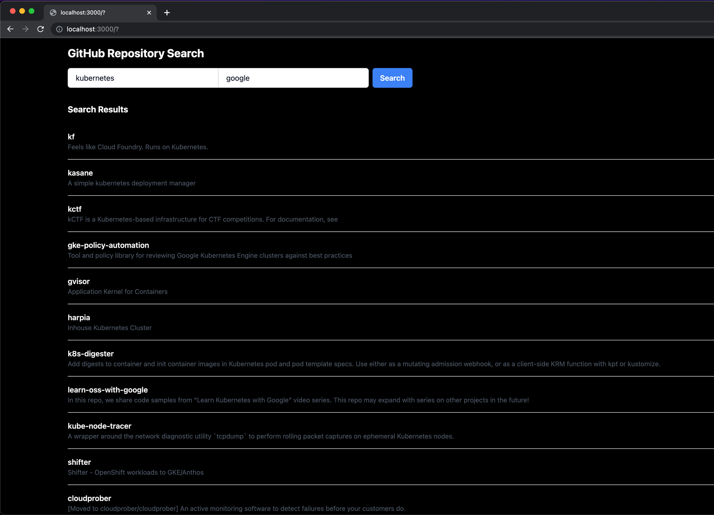

## 起動方法

### バックエンド
shellにて
```
cd backend
uvicorn api.main:app --reload
```

### フロントエンド
shellにて
```
cd frontend/git-app
yarn dev
```

`http://localhost:3000`に接続


# 燈株式会社 ソフトウェアエンジニアインターン課題

**⚠️注意事項**

**- 期限は厳守をお願いいたします**

**- 提出期限に遅れた場合は不合格となります**

## 概要

ブラウザでキーワードとユーザー名を入力して、バックエンドでgithub API経由で検索を実行して、その結果を最大50件表示するアプリケーションを作成してください。

結果は、リポジトリ名とリポジトリの説明を表示してください。

また下記機能のうち1つ以上を選択して、実装してください。
1. 検索結果にリンクを付けてリポジトリ(GitHub)を別タブで開く
2. 検索中は通信中であることがわかるようにローディングアイコンなどを表示する
3. 更新日時、スター数、フォーク数でソートした検索ができるようにする
4. 1ページ50件として、すべての検索結果にアクセスできるようにページネーションを実装する
5. [vitest](https://vitest.dev/)を用いてフロントエンドに単体テストを実装する

以下のスクリーンショットは、キーワード「kubernetes」、ユーザー名「google」で実行した例です。必ずしもデザインを厳密に一致させる必要はありませんが、可能な限り揃えてください。



## 技術条件

**バックエンド**
- 言語：Python 3.11
- フレームワーク：[FastAPI](https://fastapi.tiangolo.com/ja/)
- ライブラリ管理：poetry
- インフラ：Docker Composeを用いたコンテナ

**フロントエンド**
- 言語：TypeScript
- フレームワーク：[Next.js](https://nextjs.org/)
- ライブラリ管理：yarn

**全般**
- python, typescript は共に適切な型アノテーションを行ってください。
- ライブラリ管理を適切に行ってください。
- エラーハンドリングを適切に行なってください。
- フォーマッターやリンターを適切に適用してください。
  - 特に、backendはgithub actionsが通るか確認してください

## 評価観点

- 技術条件を漏れなく満たしていること
- 各ライブラリのドキュメントのプラクティスに則ったソースコード
- チーム開発を意識したコードスタイル・READMEの管理・gitの利用 
- 提出速度

## 期限

- 2週間目安

## 提出方法

- リポジトリにPull Requestを出してください。Pull Requestの概要に、動作している動画を添付してください。
    - PRの出し方がわからない方はこちらの[記事](https://tonari-it.com/github-pull-request/)参照
    - また、マージは勝手に行わないようにしてください。
- 面談担当者にPull Requestを出した旨の連絡をお願いします

## 禁止事項

選考の内容や課題の内容を他人に口外したり、をインターネットに公開することは禁止です。
